# Pokemon Matchups

Pokemon Matchups is a site that that is aimed at people who have an intermediate knowledge of pokemon type matchups. This website aims to provide a fun and helpful way for user to test their pokemon knowledge.

Pokemon Matchups is ultimately a website where users can put what they have already learned about Pokemon to the test.

# Design

In this section I will cover the overall design choices of this project.

## Design goals

The overall goal with the design of this project is to make it instantly recognisable what this application is about, create an interface that is simple and easy to use, while also making it visually appealing to the user.

## Tools

This project was done entirely in JavaScript, HTML5, and CSS3

## Layout

This project has aimed to have a clear layout. I have done this by using a logo and a large header that the user will instantly
be able to know what the the application is about. I have also included a brief introduction and instructions on how to get the game started

Inside the game area, the first thing you will see is two large buttons. Both of these buttons are clearly labeled so that the user can select which game they would like toplay. I have also stylised these with small images that represent the attack and defense nature of the games, as well as colour coded them in red and blue.

Underneath these buttons you will see the difficulty buttons, which all share one type of styling.

There is also the section for the user to input their name and a score area to keep track of right/wrong answers below the boxed off area with all the interactable sspactes of the UI.

In terms of font and styling, I decided to go with more jagged and blocking buttons and font elements as I felt that these were similar to that of old-school videogames.

All buttons also have a hover effect, and keep this effect when clicked to show the user what they have selected. Only one buttons of each type of button can be selected at a time, to the other clicked button will automaticall deselect.

When the user has entered either game, the opposing type will appear on the top of the game area. I had decided to put it here as they will not have to scroll to the bottom of the screen on smaller screen sizes. Under them, they will see the available types they can choose from, organised in rows of 4 on bigger screens, and decreasing on smaller screens.

## Colour Scheme

The colour scheme that I have used for this project is majority grey, red, blue, and black. I had decided on these colours to compliment the pokeball logo image I am using, as well as red and blue as pop colours to show the user that the areas using them are important and main feature of the application. I had also used some green and red on the scoring section, to represent positive and negative results.

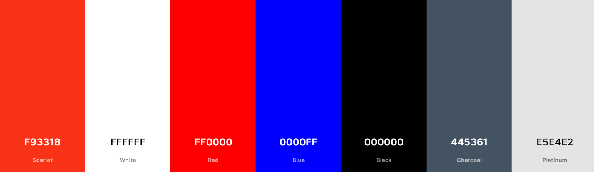

# Features

In this section I will be covering the various features I have implemented. This application has 2 sepearte game mode, as well as 3 difficulty options, ultimately making a total combination of 6 game options. I have also implemented a feature that allows the user to enter their name before playing the game, which the game will use to give feedback to the user.

In the attack game, the user will see a type at the top of the game area. The user must then select what type of pokemon type is strong against this random one. If the user is correct an alert will pop down congratulating them. If they are incorrect, an alert will pop down telling them to try again. In both instances, the user is taken back to the interface to select a new game type, or select the same one if they so choose.

The defense game works very similar to this, as a type will appear at the top of the game area, but in this case they must choose a type that is weak against the random type. The alerts for this game are the same and they will be taken back to the selection screen after.

Depending on if their answers is correct or incorrect, the score will increment at the bottom of the screen. The score is visible at all time.

The difficulty will change some apsects of the game. In the easy difficulty, the user will only have 4 types to pick from, and also the random type they are against will only be one of those 4. In the medium difficulty this is increased to 6, and finally, in the hard difficulty this is increase again to 8.

# User Stories

- User Story 1: First impression of site functions.
- As a new user, I am a beginner to intermediate Pokemon player. I want to test my knowledge on this topic.

- User Story 2: Different buttons and their effects.
- As a user, I want to be able to clearly understand what each button on my screen does.

- User Story 3: Keeping track of progress.
- As a user, I want to be able to see how I am doing after each round, and see my grand total scores.

- User Story 4: Game flow.
- As a user, I want to understand what I have to do once I enter the game.

- User Story 5: What has been selected.
- As a user, I want to know what I have currently selected and which game I will be brought to before hitting play.

# Wireframes

Please see attached wireframes for the main page and game area. I have used desktop and mobile as my basis as large tablets appear like desktop and small tablets appear like mobile. The layout for attack and defense games are also identical, so they will both use the same wireframe.

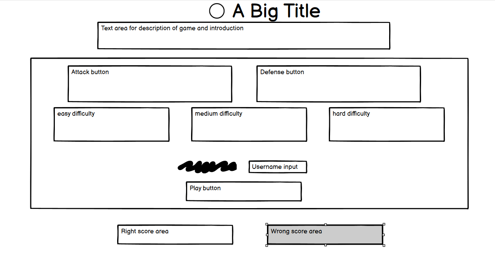
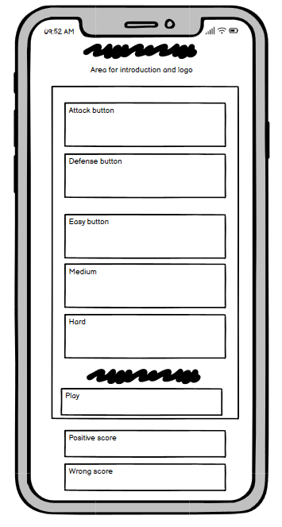
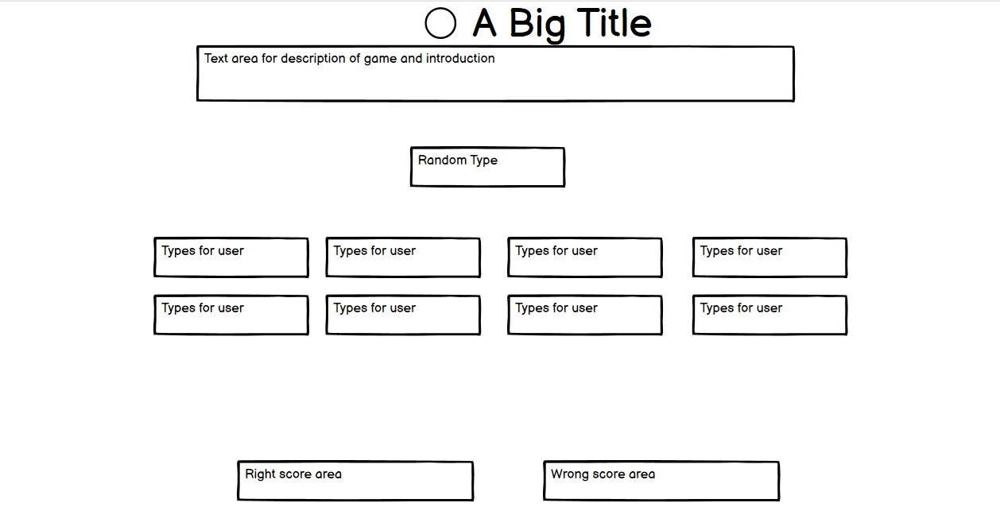
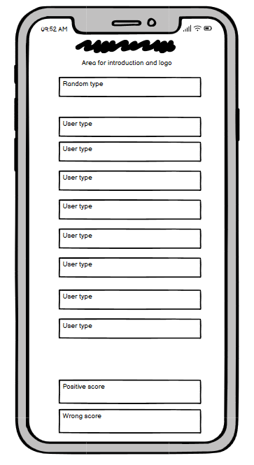

# Logo, Header, and Intro

- The Logo and Header

- First thing a user see's. Designed to explain the functionality of the application and also make the subject matter very evident.
- This is shown both at the interface and while playing the game.

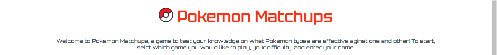

# Game Area

- Box containing all the buttons needed to access the game.

- This was designed to clearly and easily show what each button does.
- Each button is supposed to show the user what they can expect by clicking it.
- All of this buttons have been put inside of a need box, so that the user knows they muxt complete all fields before being able to play.

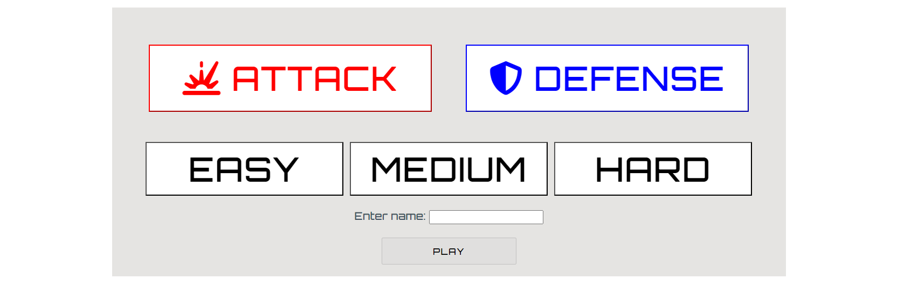

## Game Mode Buttons

- The first two buttons are the game mode buttons for the attack game and the defense game.
- They are both seperated by colour and can clearly be distinguished from one and other.
- They have been designed so that only one can be clicked at a time, and so that the system can read what game they would like to play correctly.

## Difficulty Buttons

- These buttons are designed so the user can select which difficulty to play.
- They all have the same styling, and like the game mode buttons, only one can be selected at a time.

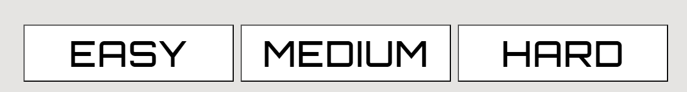

## Username and Play Button

- This section is designed to that the user can enter their name, and then have that used for alerts at the end of the game.
- The play button will be clickable once all other buttons have been clicked. This will take you to whichever game is selected.

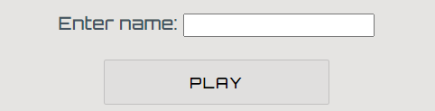

# Score Area

- This section is designed so the user can keep track of how they are doing in the game.

- This information will be displayed at all times.

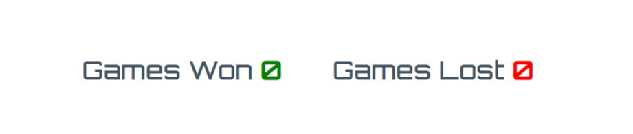

# Attack Game (Easy - Hard)

- The Attack Game

- This is one of the teo game modes that the user is able to play from.
- This game has been designed to be intuitive for the user to use. The random element is displayed at the top of the page and the player must then guess which type would be effective.
- The user must select the type which they think is strong against the random type.
- The options for the user are displayed horizontally in rows of 4, which will decrease as the screen gets smaller.
- The difficulty option selected by the user before entering this game will determine how many types they can pick from, and also how many types can be randomly generated.
- In easy mode, there will be 4 types all displayed horizontally.
- In medium mode, there will be 6 types on two rows, 4 on the first and 2 on the second.
- In hard mode, there will be 8 types on two roes, each displaying 4.
- There is also a short paragraph asking you the question of which type to pick.

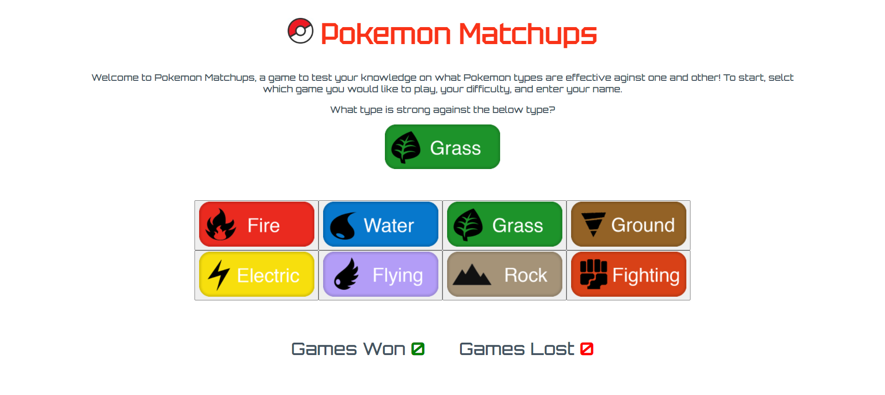

# Defense Game (Easy - Hard)

- The Defense Game

- This is the second game mode that the user is able to pick from.
- Visually very similar to the attack game, however the correct answer is different.
- This game has been designed to be intuitive for the user to use. The random element is displayed at the top of the page and the player must then guess which type would be effective.
- The user must select the type that they think is weak against the random type.
- The options for the user are displayed horizontally in rows of 4, which will decrease as the screen gets smaller.
- The difficulty option selected by the user before entering this game will determine how many types they can pick from, and also how many types can be randomly generated.
- In easy mode, there will be 4 types all displayed horizontally.
- In medium mode, there will be 6 types on two rows, 4 on the first and 2 on the second.
- In hard mode, there will be 8 types on two roes, each displaying 4.
- There is also a short paragraph asking you the question of which type to pick.

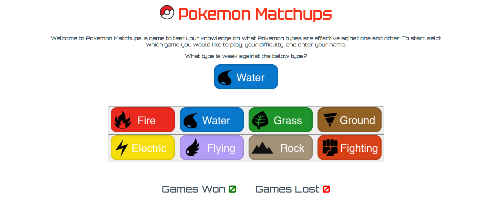

# Alerts

- Alerts that are given at the end of each game to let the user know if they are right or wrong.

- This alerts will appear after the user has selected there answer.
- The alert will give a short congratulatory message or a message telling them to try another game.
- Omce these alerts are seen, the user is taken back to the interface and the score will increment.

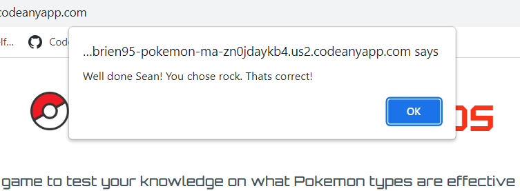

# Future Features

- There are a number of features that I have come up with that could be added at a later stage, I have not implemented them due to time constraints.
- There are a total of 18 different pokemon types, this is an obvious feature that I could include these in the game sections. My reason for not doing so is that this is geared more toward beginners and intermediate plays and did not want to overwhelm them.
- 3 round feature. I orifinally wanted the game to have a best of 3 feature but ultimately cut it out. My reason for tjhis is that the code began to have too many global variables and felt I need to cut it down.
- Timer feature for difficulty. This was a feature I was originally going to include with the 3 round system. Moving back to a single round, I felt the timer did not add much so removed it. I would like to implement this feature in the future however.

# Testing

- Ran html through W3C validator and Jigsaw css validator with no issues. HAve received some warnings and undefined variables on JSHint however upon examination needed these to function.

- I have checked screen compatibility for phone and tablet, I have checked tablet by using the inspect tool and shrinking down to size and have tested on my own personal mobile to assure it is responsive.

# Bugs

Throughout the project I had encountered several bugs which I will give details of in this section.

Resolved bugs:

- An issue I encountered was when when I was programming the defense game. When I entered the game the uer options were appearing, but not the random type. Upon investigation, I found that the user buttons were making the scores go up. This was due to my query selector using the same class to target my attack game image. I split these into IDs and then targeted those instead, and it was working as intended.
- Another issue I encountered was my defense game behaving the same as my attack game. Was unsure why and when I investigated I was calling the wrong array giving the same result. I changed my function to look for the weakness instead and worked perfectly.
- Another issue I has was with alerts. At the time I was attempting to implement a 3 eound system which did not make it to the end. When I clicked play my alerts whre appearing before the start of the game. I removed this feature and restructured my how my alerts were being called to resolve the issue.
- Another issue I had was correctly getting the username to appear. In the alert I kept getting the object or undefined. I realised this was being passed through the system incorrectly. I changed the variable name and this solved the issue.

Unresolved bugs:

- There are no unresolved bugs in the project to my knowing.

# Lighthouse Testing

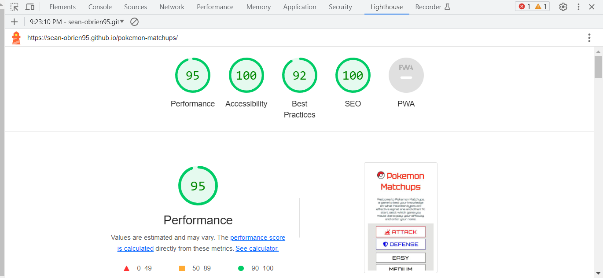

# Full Testing

The following devices were used during testing:

Desktop:

- Acer Aspire 5 17" screen

Tablet:

- iPad Air
- iPad Mini

Mobile Devices:

- iPhone 12
- iPhone 12 Pro
- Samsung Galaxy S8+

The following browsers were used during testing:

- Google Chrome
- Safari

## User Interface Testing

<table>
    <tr>
        <th>Feature</th>
        <th>Expected Outcome</th>
        <th>Test</th>
        <th>Result</th>
        <th>Pass/Fail</th>
    </tr>
    <tr>
        <td>Game Option Button Fade</td>
        <td>When hovering over button fade effect appears</td>
        <td>Hovered over attack, defense, easy, medium, and hard button</td>
        <td>Fades to assigned colour</td>
        <td>pass</td>
    </tr>
    <tr>
        <td>Only one game mode can be clicked at a time</td>
        <td>Only either attack or defense can be clicked, not both</td>
        <td>Click attack, then click defense, then click attack again</td>
        <td>Attack became highlighted, then defense became highlighted and attack lost highlight, the attack became highlighted and defense lost it's highlight</td>
        <td>pass</td>
    </tr>
    <tr>
        <td>Easy can not be clicked  at same time as medium or hard</td>
        <td>Easy, medium, and hard difficulty can not be clicked at same time</td>
        <td>Click easy, then click medium, then click easy again, then click hard</td>
        <td>Easy became highlighted, then medium, then easy again, then hard</td>
        <td>pass</td>
    </tr>
    <tr>
        <td>Medium can not be clicked  at same time as easy or hard</td>
        <td>Easy, medium, and hard difficulty can not be clicked at same time</td>
        <td>Click medium, then click easy, then click medium again, then click hard</td>
        <td>Medium became highlighted, then easy, then medium again, then hard</td>
        <td>pass</td>
    </tr>
    <tr>
        <td>Hard can not be clicked  at same time as easy or medium</td>
        <td>Easy, medium, and hard difficulty can not be clicked at same time</td>
        <td>Click hard, then click easy, then click hard again, then click medium</td>
        <td>Hard became highlighted, then easy, then hard again, then medium</td>
        <td>pass</td>
    </tr>
    <tr>
        <td>Play button diabled</td>
        <td>The play button will not be able to be clciked until all fields have been selected/filled</td>
        <td>Try and click play button without everything completed</td>
        <td>Play button remains disabled and nothing happens</td>
        <td>pass</td>
    </tr>
    <tr>
        <td>Play button activates</td>
        <td>The play button will be clickable after all fields have been filled in</td>
        <td>Try and click play button with everything completed</td>
        <td>Play button starts game</td>
        <td>pass</td>
    </tr>
    <tr>
        <td>Right answers increment games won</td>
        <td>The games won section of the score area will increase in value after getting a round correct</td>
        <td>Entered game and answered correctly</td>
        <td>Games won increased by one</td>
        <td>pass</td>
    </tr>
    <tr>
        <td>Wrong answers increment games lost</td>
        <td>The games lost section of the score area will increase in value after getting a round wrong</td>
        <td>Entered game and answered incorrectly</td>
        <td>Games lost increased by one</td>
        <td>pass</td>
    </tr>
    <tr>
        <td>Username input</td>
        <td>The enter name: area will take allow user to input any text</td>
        <td>Entered name while other buttons pressed</td>
        <td>play button activated and allowed me to play game</td>
        <td>pass</td>
    </tr>
    <tr>
        <td>Username Blank input</td>
        <td>The enter name: area will not be considered filled if the user input blank spaces and nothing else</td>
        <td>Entered blank spaces while other buttons clicked</td>
        <td>play button did not activated</td>
        <td>pass</td>
    </tr>
</table>

## Game Direction Testing

<table>
    <tr>
        <th>Feature</th>
        <th>Expected Outcome</th>
        <th>Test</th>
        <th>Result</th>
        <th>Pass/Fail</th>
    </tr>
    <tr>
        <td>Acessing the Attack game on Easy difficulty</td>
        <td>Checking if this button combination takes you to correct game</td>
        <td>Click Attack, click Easy, fill out name space and hit play</td>
        <td>Takes you to the attack game with only 4 options for me to select</td>
        <td>pass</td>
    </tr>
    <tr>
        <td>Acessing the Attack game on Medium difficulty</td>
        <td>Checking if this button combination takes you to correct game</td>
        <td>Click Attack, click Medium, fill out name space and hit play</td>
        <td>Takes you to the attack game with only 6 options for me to select</td>
        <td>pass</td>
    </tr>
    <tr>
        <td>Acessing the Attack game on Hard difficulty</td>
        <td>Checking if this button combination takes you to correct game</td>
        <td>Click Attack, click Hard, fill out name space and hit play</td>
        <td>Takes you to the attack game with all 8 options for me to select</td>
        <td>pass</td>
    </tr>
    <tr>
        <td>Acessing the Defense game on Easy difficulty</td>
        <td>Checking if this button combination takes you to correct game</td>
        <td>Click Defense, click Easy, fill out name space and hit play</td>
        <td>Takes you to the defense game with only 4 options for me to select</td>
        <td>pass</td>
    </tr>
    <tr>
        <td>Acessing the Defense game on Medium difficulty</td>
        <td>Checking if this button combination takes you to correct game</td>
        <td>Click DEfense, click Medium, fill out name space and hit play</td>
        <td>Takes you to the defense game with only 6 options for me to select</td>
        <td>pass</td>
    </tr>
    <tr>
        <td>Acessing the Defense game on Hard difficulty</td>
        <td>Checking if this button combination takes you to correct game</td>
        <td>Click Defense, click Hard, fill out name space and hit play</td>
        <td>Takes you to the defense game with all 8 options for me to select</td>
        <td>pass</td>
    </tr>
</table>

## Attack Game Testing

<table>
    <tr>
        <th>Feature</th>
        <th>Expected Outcome</th>
        <th>Test</th>
        <th>Result</th>
        <th>Pass/Fail</th>
    </tr>
    <tr>
        <td>Random type is fire, user type is fire, give incorrect alert</td>
        <td>Fire type is generated and the user clicks fire, they will get an incorrect alert and games lost will increase</td>
        <td>Click on fire when fire has been selected as random type</td>
        <td>Incorrect alert appears, games lost increments by one</td>
        <td>pass</td>
    </tr>
    <tr>
        <td>Random type is fire, user type is water, give correct alert</td>
        <td>Fire type is generated and the user clicks water, they will get a correct alert and games won will increase</td>
        <td>Click on water when fire has been selected as random type</td>
        <td>Correct alert appears, games won increments by one</td>
        <td>pass</td>
    </tr>
    <tr>
        <td>Random type is fire, user type is grass, give incorrect alert</td>
        <td>Fire type is generated and the user clicks grass, they will get an incorrect alert and games lost will increase</td>
        <td>Click on grass when fire has been selected as random type</td>
        <td>Incorrect alert appears, games lost increments by one</td>
        <td>pass</td>
    </tr>
    <tr>
        <td>Random type is fire, user type is ground, give correct alert</td>
        <td>Fire type is generated and the user clicks ground, they will get a correct alert and games won will increase</td>
        <td>Click on ground when fire has been selected as random type</td>
        <td>Correct alert appears, games won increments by one</td>
        <td>pass</td>
    </tr>
    <tr>
        <td>Random type is fire, user type is electric, give incorrect alert</td>
        <td>Fire type is generated and the user clicks electric, they will get an incorrect alert and games lost will increase</td>
        <td>Click on electric when fire has been selected as random type</td>
        <td>Incorrect alert appears, games lost increments by one</td>
        <td>pass</td>
    </tr>
    <tr>
        <td>Random type is fire, user type is flying, give incorrect alert</td>
        <td>Fire type is generated and the user clicks flying, they will get an incorrect alert and games lost will increase</td>
        <td>Click on flying when fire has been selected as random type</td>
        <td>Incorrect alert appears, games lost increments by one</td>
        <td>pass</td>
    </tr>
    <tr>
        <td>Random type is fire, user type is rock, give correct alert</td>
        <td>Fire type is generated and the user clicks rock, they will get a correct alert and games won will increase</td>
        <td>Click on rock when fire has been selected as random type</td>
        <td>Correct alert appears, games won increments by one</td>
        <td>pass</td>
    </tr>
    <tr>
        <td>Random type is fire, user type is fighting, give incorrect alert</td>
        <td>Fire type is generated and the user clicks fighting, they will get an incorrect alert and games lost will increase</td>
        <td>Click on fighting when fire has been selected as random type</td>
        <td>Incorrect alert appears, games lost increments by one</td>
        <td>pass</td>
    </tr>
    <tr>
        <td>Random type is water, user type is fire, give incorrect alert</td>
        <td>Water type is generated and the user clicks fire, they will get an incorrect alert and games lost will increase</td>
        <td>Click on fire when water has been selected as random type</td>
        <td>Incorrect alert appears, games lost increments by one</td>
        <td>pass</td>
    </tr>
    <tr>
        <td>Random type is water, user type is water, give incorrect alert</td>
        <td>Water type is generated and the user clicks water, they will get an incorrect alert and games lost will increase</td>
        <td>Click on water when water has been selected as random type</td>
        <td>Incorrect alert appears, games lost increments by one</td>
        <td>pass</td>
    </tr>
    <tr>
        <td>Random type is water, user type is grass, give correct alert</td>
        <td>Water type is generated and the user clicks grass, they will get a correct alert and games won will increase</td>
        <td>Click on grass when water has been selected as random type</td>
        <td>Correct alert appears, games won increments by one</td>
        <td>pass</td>
    </tr>
    <tr>
        <td>Random type is water, user type is ground, give incorrect alert</td>
        <td>Water type is generated and the user clicks ground, they will get an incorrect alert and games lost will increase</td>
        <td>Click on ground when water has been selected as random type</td>
        <td>Incorrect alert appears, games lost increments by one</td>
        <td>pass</td>
    </tr>
    <tr>
        <td>Random type is water, user type is electric, give correct alert</td>
        <td>Water type is generated and the user clicks electric, they will get a correct alert and games won will increase</td>
        <td>Click on electric when water has been selected as random type</td>
        <td>Correct alert appears, games won increments by one</td>
        <td>pass</td>
    </tr>
    <tr>
        <td>Random type is water, user type is flying, give incorrect alert</td>
        <td>Water type is generated and the user clicks flying, they will get an incorrect alert and games lost will increase</td>
        <td>Click on flying when water has been selected as random type</td>
        <td>Incorrect alert appears, games lost increments by one</td>
        <td>pass</td>
    </tr>
    <tr>
        <td>Random type is water, user type is rock, give incorrect alert</td>
        <td>Water type is generated and the user clicks rock, they will get an incorrect alert and games lost will increase</td>
        <td>Click on rock when water has been selected as random type</td>
        <td>Incorrect alert appears, games lost increments by one</td>
        <td>pass</td>
    </tr>
    <tr>
        <td>Random type is water, user type is fighting, give incorrect alert</td>
        <td>Water type is generated and the user clicks fighting, they will get an incorrect alert and games lost will increase</td>
        <td>Click on fighting when water has been selected as random type</td>
        <td>Incorrect alert appears, games lost increments by one</td>
        <td>pass</td>
    </tr>
    <tr>
        <td>Random type is grass, user type is fire, give correct alert</td>
        <td>Grass type is generated and the user clicks fire, they will get a correct alert and games won will increase</td>
        <td>Click on fire when grass has been selected as random type</td>
        <td>Correct alert appears, games won increments by one</td>
        <td>pass</td>
    </tr>
    <tr>
        <td>Random type is grass, user type is water, give incorrect alert</td>
        <td>Grass type is generated and the user clicks water, they will get an incorrect alert and games lost will increase</td>
        <td>Click on water when grass has been selected as random type</td>
        <td>Incorrect alert appears, games lost increments by one</td>
        <td>pass</td>
    </tr>
    <tr>
        <td>Random type is grass, user type is grass, give incorrect alert</td>
        <td>Grass type is generated and the user clicks grass, they will get an incorrect alert and games lost will increase</td>
        <td>Click on grass when grass has been selected as random type</td>
        <td>Incorrect alert appears, games lost increments by one</td>
        <td>pass</td>
    </tr>
    <tr>
        <td>Random type is grass, user type is ground, give incorrect alert</td>
        <td>Grass type is generated and the user clicks ground, they will get an incorrect alert and games lost will increase</td>
        <td>Click on ground when grass has been selected as random type</td>
        <td>Incorrect alert appears, games lost increments by one</td>
        <td>pass</td>
    </tr>
    <tr>
        <td>Random type is grass, user type is electric, give incorrect alert</td>
        <td>Grass type is generated and the user clicks electric, they will get an incorrect alert and games lost will increase</td>
        <td>Click on electric when grass has been selected as random type</td>
        <td>Incorrect alert appears, games lost increments by one</td>
        <td>pass</td>
    </tr>
    <tr>
        <td>Random type is grass, user type is flying, give correct alert</td>
        <td>Grass type is generated and the user clicks flying, they will get a correct alert and games won will increase</td>
        <td>Click on flying when grass has been selected as random type</td>
        <td>Correct alert appears, games won increments by one</td>
        <td>pass</td>
    </tr>
    <tr>
        <td>Random type is grass, user type is rock, give incorrect alert</td>
        <td>Grass type is generated and the user clicks rock, they will get an incorrect alert and games lost will increase</td>
        <td>Click on rock when grass has been selected as random type</td>
        <td>Incorrect alert appears, games lost increments by one</td>
        <td>pass</td>
    </tr>
    <tr>
        <td>Random type is grass, user type is fighting, give incorrect alert</td>
        <td>Grass type is generated and the user clicks fighting, they will get an incorrect alert and games lost will increase</td>
        <td>Click on fighting when grass has been selected as random type</td>
        <td>Incorrect alert appears, games lost increments by one</td>
        <td>pass</td>
    </tr>
    <tr>
        <td>Random type is ground, user type is fire, give incorrect alert</td>
        <td>Ground type is generated and the user clicks fire, they will get an incorrect alert and games lost will increase</td>
        <td>Click on fire when ground has been selected as random type</td>
        <td>Incorrect alert appears, games lost increments by one</td>
        <td>pass</td>
    </tr>
    <tr>
        <td>Random type is ground, user type is water, give correct alert</td>
        <td>Ground type is generated and the user clicks water, they will get a correct alert and games won will increase</td>
        <td>Click on water when ground has been selected as random type</td>
        <td>Correct alert appears, games won increments by one</td>
        <td>pass</td>
    </tr>
    <tr>
        <td>Random type is ground, user type is grass, give correct alert</td>
        <td>Ground type is generated and the user clicks grass, they will get a correct alert and games won will increase</td>
        <td>Click on grass when ground has been selected as random type</td>
        <td>Correct alert appears, games won increments by one</td>
        <td>pass</td>
    </tr>
    <tr>
        <td>Random type is ground, user type is ground, give incorrect alert</td>
        <td>Ground type is generated and the user clicks ground, they will get an incorrect alert and games lost will increase</td>
        <td>Click on ground when ground has been selected as random type</td>
        <td>Incorrect alert appears, games lost increments by one</td>
        <td>pass</td>
    </tr>
    <tr>
        <td>Random type is ground, user type is electric, give incorrect alert</td>
        <td>Ground type is generated and the user clicks electric, they will get an incorrect alert and games lost will increase</td>
        <td>Click on electric when ground has been selected as random type</td>
        <td>Incorrect alert appears, games lost increments by one</td>
        <td>pass</td>
    </tr>
    <tr>
        <td>Random type is ground, user type is flying, give incorrect alert</td>
        <td>Ground type is generated and the user clicks flying, they will get an incorrect alert and games lost will increase</td>
        <td>Click on flying when ground has been selected as random type</td>
        <td>Incorrect alert appears, games lost increments by one</td>
        <td>pass</td>
    </tr>
    <tr>
        <td>Random type is ground, user type is rock, give incorrect alert</td>
        <td>Ground type is generated and the user clicks rock, they will get an incorrect alert and games lost will increase</td>
        <td>Click on rock when ground has been selected as random type</td>
        <td>Incorrect alert appears, games lost increments by one</td>
        <td>pass</td>
    </tr>
    <tr>
        <td>Random type is ground, user type is fighting, give incorrect alert</td>
        <td>Ground type is generated and the user clicks fighting, they will get an incorrect alert and games lost will increase</td>
        <td>Click on fighting when ground has been selected as random type</td>
        <td>Incorrect alert appears, games lost increments by one</td>
        <td>pass</td>
    </tr>
    <tr>
        <td>Random type is electric, user type is fire, give incorrect alert</td>
        <td>Electric type is generated and the user clicks fire, they will get an incorrect alert and games lost will increase</td>
        <td>Click on fire when Electric has been selected as random type</td>
        <td>Incorrect alert appears, games lost increments by one</td>
        <td>pass</td>
    </tr>
    <tr>
        <td>Random type is electric, user type is water, give incorrect alert</td>
        <td>Electric type is generated and the user clicks water, they will get an incorrect alert and games lost will increase</td>
        <td>Click on water when Electric has been selected as random type</td>
        <td>Incorrect alert appears, games lost increments by one</td>
        <td>pass</td>
    </tr>
    <tr>
        <td>Random type is electric, user type is grass, give incorrect alert</td>
        <td>Electric type is generated and the user clicks grass, they will get an incorrect alert and games lost will increase</td>
        <td>Click on grass when Electric has been selected as random type</td>
        <td>Incorrect alert appears, games lost increments by one</td>
        <td>pass</td>
    </tr>
    <tr>
        <td>Random type is electric, user type is ground, give correct alert</td>
        <td>Electric type is generated and the user clicks ground, they will get a correct alert and games won will increase</td>
        <td>Click on ground when Electric has been selected as random type</td>
        <td>Incorrect alert appears, games lost increments by one</td>
        <td>pass</td>
    </tr>
    <tr>
        <td>Random type is electric, user type is electric, give incorrect alert</td>
        <td>Electric type is generated and the user clicks electric, they will get an incorrect alert and games lost will increase</td>
        <td>Click on electric when Electric has been selected as random type</td>
        <td>Incorrect alert appears, games lost increments by one</td>
        <td>pass</td>
    </tr>
    <tr>
        <td>Random type is electric, user type is flying, give incorrect alert</td>
        <td>Electric type is generated and the user clicks flying, they will get an incorrect alert and games lost will increase</td>
        <td>Click on flting when Electric has been selected as random type</td>
        <td>Incorrect alert appears, games lost increments by one</td>
        <td>pass</td>
    </tr>
    <tr>
        <td>Random type is electric, user type is rock, give incorrect alert</td>
        <td>Electric type is generated and the user clicks rock, they will get an incorrect alert and games lost will increase</td>
        <td>Click on rock when Electric has been selected as random type</td>
        <td>Incorrect alert appears, games lost increments by one</td>
        <td>pass</td>
    </tr>
    <tr>
        <td>Random type is electric, user type is fighting, give incorrect alert</td>
        <td>Electric type is generated and the user clicks fighting, they will get an incorrect alert and games lost will increase</td>
        <td>Click on fighting when Electric has been selected as random type</td>
        <td>Incorrect alert appears, games lost increments by one</td>
        <td>pass</td>
    </tr>
    <tr>
        <td>Random type is flying, user type is fire, give incorrect alert</td>
        <td>Flying type is generated and the user clicks fire, they will get an incorrect alert and games lost will increase</td>
        <td>Click on fire when flying has been selected as random type</td>
        <td>Incorrect alert appears, games lost increments by one</td>
        <td>pass</td>
    </tr>
    <tr>
        <td>Random type is flying, user type is water, give incorrect alert</td>
        <td>Flying type is generated and the user clicks water, they will get an incorrect alert and games lost will increase</td>
        <td>Click on water when flying has been selected as random type</td>
        <td>Incorrect alert appears, games lost increments by one</td>
        <td>pass</td>
    </tr>
    <tr>
        <td>Random type is flying, user type is grass, give incorrect alert</td>
        <td>Flying type is generated and the user clicks grass, they will get an incorrect alert and games lost will increase</td>
        <td>Click on grass when flying has been selected as random type</td>
        <td>Incorrect alert appears, games lost increments by one</td>
        <td>pass</td>
    </tr>
    <tr>
        <td>Random type is flying, user type is ground, give incorrect alert</td>
        <td>Flying type is generated and the user clicks ground, they will get an incorrect alert and games lost will increase</td>
        <td>Click on ground when flying has been selected as random type</td>
        <td>Incorrect alert appears, games lost increments by one</td>
        <td>pass</td>
    </tr>
    <tr>
        <td>Random type is flying, user type is electric, give correct alert</td>
        <td>Flying type is generated and the user clicks electric, they will get a correct alert and games won will increase</td>
        <td>Click on electric when flying has been selected as random type</td>
        <td>Correct alert appears, games lost increments by one</td>
        <td>pass</td>
    </tr>
    <tr>
        <td>Random type is flying, user type is flying, give incorrect alert</td>
        <td>Flying type is generated and the user clicks flying, they will get an incorrect alert and games lost will increase</td>
        <td>Click on flying when flying has been selected as random type</td>
        <td>Incorrect alert appears, games lost increments by one</td>
        <td>pass</td>
    </tr>
    <tr>
        <td>Random type is flying, user type is rock, give correct alert</td>
        <td>Flying type is generated and the user clicks rock, they will get a correct alert and games won will increase</td>
        <td>Click on rock when flying has been selected as random type</td>
        <td>Correct alert appears, games won increments by one</td>
        <td>pass</td>
    </tr>
    <tr>
        <td>Random type is flying, user type is fighting, give incorrect alert</td>
        <td>Flying type is generated and the user clicks fighting, they will get an incorrect alert and games lost will increase</td>
        <td>Click on fighting when flying has been selected as random type</td>
        <td>Incorrect alert appears, games lost increments by one</td>
        <td>pass</td>
    </tr>
    <tr>
        <td>Random type is rock, user type is fire, give incorrect alert</td>
        <td>Rock type is generated and the user clicks fire, they will get an incorrect alert and games lost will increase</td>
        <td>Click on fire when rock has been selected as random type</td>
        <td>Incorrect alert appears, games lost increments by one</td>
        <td>pass</td>
    </tr>
    <tr>
        <td>Random type is rock, user type is water, give correct alert</td>
        <td>Rock type is generated and the user clicks water, they will get a correct alert and games won will increase</td>
        <td>Click on water when rock has been selected as random type</td>
        <td>Correct alert appears, games won increments by one</td>
        <td>pass</td>
    </tr>
    <tr>
        <td>Random type is rock, user type is grass, give correct alert</td>
        <td>Rock type is generated and the user clicks grass, they will get a correct alert and games won will increase</td>
        <td>Click on grass when rock has been selected as random type</td>
        <td>Correct alert appears, games won increments by one</td>
        <td>pass</td>
    </tr>
    <tr>
        <td>Random type is rock, user type is ground, give incorrect alert</td>
        <td>Rock type is generated and the user clicks ground, they will get an incorrect alert and games lost will increase</td>
        <td>Click on ground when rock has been selected as random type</td>
        <td>Incorrect alert appears, games lost increments by one</td>
        <td>pass</td>
    </tr>
    <tr>
        <td>Random type is rock, user type is electric, give incorrect alert</td>
        <td>Rock type is generated and the user clicks fire, they will get an incorrect alert and games lost will increase</td>
        <td>Click on electric when rock has been selected as random type</td>
        <td>Incorrect alert appears, games lost increments by one</td>
        <td>pass</td>
    </tr>
    <tr>
        <td>Random type is rock, user type is flying, give incorrect alert</td>
        <td>Rock type is generated and the user clicks flying, they will get an incorrect alert and games lost will increase</td>
        <td>Click on flying when rock has been selected as random type</td>
        <td>Incorrect alert appears, games lost increments by one</td>
        <td>pass</td>
    </tr>
    <tr>
        <td>Random type is rock, user type is rock, give incorrect alert</td>
        <td>Rock type is generated and the user clicks rock, they will get an incorrect alert and games lost will increase</td>
        <td>Click on rock when rock has been selected as random type</td>
        <td>Incorrect alert appears, games lost increments by one</td>
        <td>pass</td>
    </tr>
    <tr>
        <td>Random type is rock, user type is fighting, give correct alert</td>
        <td>Rock type is generated and the user clicks fighting, they will get a correct alert and games won will increase</td>
        <td>Click on fighting when rock has been selected as random type</td>
        <td>Correct alert appears, games won increments by one</td>
        <td>pass</td>
    </tr>
    <tr>
        <td>Random type is fighting, user type is fire, give incorrect alert</td>
        <td>Fighting type is generated and the user clicks fire, they will get an incorrect alert and games lost will increase</td>
        <td>Click on fire when fighting has been selected as random type</td>
        <td>Incorrect alert appears, games lost increments by one</td>
        <td>pass</td>
    </tr>
    <tr>
        <td>Random type is fighting, user type is water, give incorrect alert</td>
        <td>Fighting type is generated and the user clicks water, they will get an incorrect alert and games lost will increase</td>
        <td>Click on water when fighting has been selected as random type</td>
        <td>Incorrect alert appears, games lost increments by one</td>
        <td>pass</td>
    </tr>
    <tr>
        <td>Random type is fighting, user type is grass, give incorrect alert</td>
        <td>Fighting type is generated and the user clicks grass, they will get an incorrect alert and games lost will increase</td>
        <td>Click on grass when fighting has been selected as random type</td>
        <td>Incorrect alert appears, games lost increments by one</td>
        <td>pass</td>
    </tr>
    <tr>
        <td>Random type is fighting, user type is ground, give incorrect alert</td>
        <td>Fighting type is generated and the user clicks ground, they will get an incorrect alert and games lost will increase</td>
        <td>Click on ground when fighting has been selected as random type</td>
        <td>Incorrect alert appears, games lost increments by one</td>
        <td>pass</td>
    </tr>
    <tr>
        <td>Random type is fighting, user type is electric, give incorrect alert</td>
        <td>Fighting type is generated and the user clicks electric, they will get an incorrect alert and games lost will increase</td>
        <td>Click on electric when fighting has been selected as random type</td>
        <td>Incorrect alert appears, games lost increments by one</td>
        <td>pass</td>
    </tr>
    <tr>
        <td>Random type is fighting, user type is flying, give correct alert</td>
        <td>Fighting type is generated and the user clicks flying, they will get a correct alert and games won will increase</td>
        <td>Click on flying when fighting has been selected as random type</td>
        <td>Correct alert appears, games won increments by one</td>
        <td>pass</td>
    </tr>
    <tr>
        <td>Random type is fighting, user type is fighting, give incorrect alert</td>
        <td>Fighting type is generated and the user clicks fighting, they will get an incorrect alert and games lost will increase</td>
        <td>Click on fighting when fighting has been selected as random type</td>
        <td>Incorrect alert appears, games lost increments by one</td>
        <td>pass</td>
    </tr>
</table>

## Defense Game Testing

<table>
    <tr>
        <th>Feature</th>
        <th>Expected Outcome</th>
        <th>Test</th>
        <th>Result</th>
        <th>Pass/Fail</th>
    </tr>
    <tr>
        <td>Random type is fire, user type is fire, give incorrect alert</td>
        <td>Fire type is generated and the user clicks flire, they will get an incorrect alert and games lost will increase</td>
        <td>Click on fire when fire has been selected as random type</td>
        <td>Incorrect alert appears, games lost increments by one</td>
        <td>pass</td>
    </tr>
    <tr>
        <td>Random type is fire, user type is water, give incorrect alert</td>
        <td>Fire type is generated and the user clicks water, they will get an incorrect alert and games lost will increase</td>
        <td>Click on water when fire has been selected as random type</td>
        <td>Incorrect alert appears, games lost increments by one</td>
        <td>pass</td>
    </tr>
    <tr>
        <td>Random type is fire, user type is grass, give correct alert</td>
        <td>Fire type is generated and the user clicks grass, they will get an correct alert and games lost won increase</td>
        <td>Click on grass when fire has been selected as random type</td>
        <td>Correct alert appears, games won increments by one</td>
        <td>pass</td>
    </tr>
    <tr>
        <td>Random type is fire, user type is ground, give incorrect alert</td>
        <td>Fire type is generated and the user clicks ground, they will get an incorrect alert and games lost will increase</td>
        <td>Click on ground when fire has been selected as random type</td>
        <td>Incorrect alert appears, games lost increments by one</td>
        <td>pass</td>
    </tr>
    <tr>
        <td>Random type is fire, user type is electric, give incorrect alert</td>
        <td>Fire type is generated and the user clicks electric, they will get an incorrect alert and games lost will increase</td>
        <td>Click on electric when fire has been selected as random type</td>
        <td>Incorrect alert appears, games lost increments by one</td>
        <td>pass</td>
    </tr>
    <tr>
        <td>Random type is fire, user type is flying, give incorrect alert</td>
        <td>Fire type is generated and the user clicks flying, they will get an incorrect alert and games lost will increase</td>
        <td>Click on flying when fire has been selected as random type</td>
        <td>Incorrect alert appears, games lost increments by one</td>
        <td>pass</td>
    </tr>
    <tr>
        <td>Random type is fire, user type is rock, give incorrect alert</td>
        <td>Fire type is generated and the user clicks rock, they will get an incorrect alert and games lost will increase</td>
        <td>Click on rock when fire has been selected as random type</td>
        <td>Incorrect alert appears, games lost increments by one</td>
        <td>pass</td>
    </tr>
    <tr>
        <td>Random type is fire, user type is fighting, give incorrect alert</td>
        <td>Fire type is generated and the user clicks fighting, they will get an incorrect alert and games lost will increase</td>
        <td>Click on fighting when fire has been selected as random type</td>
        <td>Incorrect alert appears, games lost increments by one</td>
        <td>pass</td>
    </tr>
    <tr>
        <td>Random type is water, user type is fire, give correct alert</td>
        <td>Water type is generated and the user clicks fire, they will get a correct alert and games won will increase</td>
        <td>Click on fire when water has been selected as random type</td>
        <td>Correct alert appears, games won increments by one</td>
        <td>pass</td>
    </tr>
    <tr>
        <td>Random type is water, user type is water, give incorrect alert</td>
        <td>Water type is generated and the user clicks water, they will get an incorrect alert and games lost will increase</td>
        <td>Click on water when water has been selected as random type</td>
        <td>Incorrect alert appears, games lost increments by one</td>
        <td>pass</td>
    </tr>
    <tr>
        <td>Random type is water, user type is grassr, give incorrect alert</td>
        <td>Water type is generated and the user clicks grass, they will get an incorrect alert and games lost will increase</td>
        <td>Click on grass when water has been selected as random type</td>
        <td>Incorrect alert appears, games lost increments by one</td>
        <td>pass</td>
    </tr>
    <tr>
        <td>Random type is water, user type is ground, give correct alert</td>
        <td>Water type is generated and the user clicks ground, they will get a correct alert and games won will increase</td>
        <td>Click on ground when water has been selected as random type</td>
        <td>Correct alert appears, games won increments by one</td>
        <td>pass</td>
    </tr>
    <tr>
        <td>Random type is water, user type is electric, give incorrect alert</td>
        <td>Water type is generated and the user clicks electric, they will get an incorrect alert and games lost will increase</td>
        <td>Click on electric when water has been selected as random type</td>
        <td>Incorrect alert appears, games lost increments by one</td>
        <td>pass</td>
    </tr>
    <tr>
        <td>Random type is water, user type is flying, give incorrect alert</td>
        <td>Water type is generated and the user clicks flying, they will get an incorrect alert and games lost will increase</td>
        <td>Click on flying when water has been selected as random type</td>
        <td>Incorrect alert appears, games lost increments by one</td>
        <td>pass</td>
    </tr>
    <tr>
        <td>Random type is water, user type is rock, give correct alert</td>
        <td>Water type is generated and the user clicks rock, they will get a correct alert and games won will increase</td>
        <td>Click on rock when water has been selected as random type</td>
        <td>Correct alert appears, games won increments by one</td>
        <td>pass</td>
    </tr>
    <tr>
        <td>Random type is water, user type is fighting, give incorrect alert</td>
        <td>Water type is generated and the user clicks fighting, they will get an incorrect alert and games lost will increase</td>
        <td>Click on fighting when water has been selected as random type</td>
        <td>Incorrect alert appears, games lost increments by one</td>
        <td>pass</td>
    </tr>
    <tr>
        <td>Random type is grass, user type is fire, give incorrect alert</td>
        <td>Grass type is generated and the user clicks fire, they will get an incorrect alert and games lost will increase</td>
        <td>Click on fire when grass has been selected as random type</td>
        <td>Incorrect alert appears, games lost increments by one</td>
        <td>pass</td>
    </tr>
    <tr>
        <td>Random type is grass, user type is water, give correct alert</td>
        <td>Grass type is generated and the user clicks water, they will get a correct alert and games won will increase</td>
        <td>Click on water when grass has been selected as random type</td>
        <td>Correct alert appears, games won increments by one</td>
        <td>pass</td>
    </tr>
    <tr>
        <td>Random type is grass, user type is grass, give incorrect alert</td>
        <td>Grass type is generated and the user clicks grass, they will get an incorrect alert and games lost will increase</td>
        <td>Click on grass when grass has been selected as random type</td>
        <td>Incorrect alert appears, games lost increments by one</td>
        <td>pass</td>
    </tr>
    <tr>
        <td>Random type is grass, user type is ground, give correct alert</td>
        <td>Grass type is generated and the user clicks ground, they will get a correct alert and games won will increase</td>
        <td>Click on ground when grass has been selected as random type</td>
        <td>Correct alert appears, games won increments by one</td>
        <td>pass</td>
    </tr>
    <tr>
        <td>Random type is grass, user type is electric, give incorrect alert</td>
        <td>Grass type is generated and the user clicks electric, they will get an incorrect alert and games lost will increase</td>
        <td>Click on electric when grass has been selected as random type</td>
        <td>Incorrect alert appears, games lost increments by one</td>
        <td>pass</td>
    </tr>
    <tr>
        <td>Random type is grass, user type is flying, give incorrect alert</td>
        <td>Grass type is generated and the user clicks flying, they will get an incorrect alert and games lost will increase</td>
        <td>Click on flying when grass has been selected as random type</td>
        <td>Incorrect alert appears, games lost increments by one</td>
        <td>pass</td>
    </tr>
    <tr>
        <td>Random type is grass, user type is rock, give correct alert</td>
        <td>Grass type is generated and the user clicks rock, they will get a correct alert and games won will increase</td>
        <td>Click on rock when grass has been selected as random type</td>
        <td>Correct alert appears, games won increments by one</td>
        <td>pass</td>
    </tr>
    <tr>
        <td>Random type is grass, user type is fighting, give incorrect alert</td>
        <td>Grass type is generated and the user clicks fighting, they will get an incorrect alert and games lost will increase</td>
        <td>Click on fighting when grass has been selected as random type</td>
        <td>Incorrect alert appears, games lost increments by one</td>
        <td>pass</td>
    </tr>
    <tr>
        <td>Random type is ground, user type is fire, give correct alert</td>
        <td>Ground type is generated and the user clicks fire, they will get a correct alert and games won will increase</td>
        <td>Click on fire when ground has been selected as random type</td>
        <td>Correct alert appears, games won increments by one</td>
        <td>pass</td>
    </tr>
    <tr>
        <td>Random type is ground, user type is water, give incorrect alert</td>
        <td>Ground type is generated and the user clicks water, they will get an incorrect alert and games lost will increase</td>
        <td>Click on water when ground has been selected as random type</td>
        <td>Incorrect alert appears, games lost increments by one</td>
        <td>pass</td>
    </tr>
    <tr>
        <td>Random type is ground, user type is grass, give incorrect alert</td>
        <td>Ground type is generated and the user clicks grass, they will get an incorrect alert and games lost will increase</td>
        <td>Click on grass when ground has been selected as random type</td>
        <td>Incorrect alert appears, games lost increments by one</td>
        <td>pass</td>
    </tr>
    <tr>
        <td>Random type is ground, user type is ground, give incorrect alert</td>
        <td>Ground type is generated and the user clicks ground, they will get an incorrect alert and games lost will increase</td>
        <td>Click on ground when ground has been selected as random type</td>
        <td>Incorrect alert appears, games lost increments by one</td>
        <td>pass</td>
    </tr>
    <tr>
        <td>Random type is ground, user type is electric, give correct alert</td>
        <td>Ground type is generated and the user clicks electric, they will get a correct alert and games won will increase</td>
        <td>Click on electric when ground has been selected as random type</td>
        <td>Correct alert appears, games won increments by one</td>
        <td>pass</td>
    </tr>
    <tr>
        <td>Random type is ground, user type is flying, give incorrect alert</td>
        <td>Ground type is generated and the user clicks flying, they will get an incorrect alert and games lost will increase</td>
        <td>Click on flying when ground has been selected as random type</td>
        <td>Incorrect alert appears, games lost increments by one</td>
        <td>pass</td>
    </tr>
    <tr>
        <td>Random type is ground, user type is rock, give incorrect alert</td>
        <td>Ground type is generated and the user clicks rock, they will get an incorrect alert and games lost will increase</td>
        <td>Click on rock when ground has been selected as random type</td>
        <td>Incorrect alert appears, games lost increments by one</td>
        <td>pass</td>
    </tr>
    <tr>
        <td>Random type is ground, user type is fighting, give incorrect alert</td>
        <td>Ground type is generated and the user clicks fighting, they will get an incorrect alert and games lost will increase</td>
        <td>Click on fighting when ground has been selected as random type</td>
        <td>Incorrect alert appears, games lost increments by one</td>
        <td>pass</td>
    </tr>
    <tr>
        <td>Random type is electric, user type is fire, give incorrect alert</td>
        <td>Electric type is generated and the user clicks fire, they will get an incorrect alert and games lost will increase</td>
        <td>Click on fire when electric has been selected as random type</td>
        <td>Incorrect alert appears, games lost increments by one</td>
        <td>pass</td>
    </tr>
    <tr>
        <td>Random type is electric, user type is water, give correct alert</td>
        <td>Electric type is generated and the user clicks water, they will get a correct alert and games won will increase</td>
        <td>Click on water when electric has been selected as random type</td>
        <td>Correct alert appears, games lost increments by one</td>
        <td>pass</td>
    </tr>
    <tr>
        <td>Random type is electric, user type is grass, give incorrect alert</td>
        <td>Electric type is generated and the user clicks grass, they will get an incorrect alert and games lost will increase</td>
        <td>Click on grass when electric has been selected as random type</td>
        <td>Incorrect alert appears, games lost increments by one</td>
        <td>pass</td>
    </tr>
    <tr>
        <td>Random type is electric, user type is ground, give incorrect alert</td>
        <td>Electric type is generated and the user clicks ground, they will get an incorrect alert and games lost will increase</td>
        <td>Click on ground when electric has been selected as random type</td>
        <td>Incorrect alert appears, games lost increments by one</td>
        <td>pass</td>
    </tr>
    <tr>
        <td>Random type is electric, user type is electric, give incorrect alert</td>
        <td>Electric type is generated and the user clicks electric, they will get an incorrect alert and games lost will increase</td>
        <td>Click on electric when electric has been selected as random type</td>
        <td>Incorrect alert appears, games lost increments by one</td>
        <td>pass</td>
    </tr>
    <tr>
        <td>Random type is electric, user type is flying, give correct alert</td>
        <td>Electric type is generated and the user clicks flying, they will get a correct alert and games won will increase</td>
        <td>Click on flying when electric has been selected as random type</td>
        <td>Correct alert appears, games lost increments by one</td>
        <td>pass</td>
    </tr>
    <tr>
        <td>Random type is electric, user type is rock, give incorrect alert</td>
        <td>Electric type is generated and the user clicks rock, they will get an incorrect alert and games lost will increase</td>
        <td>Click on flying when rock has been selected as random type</td>
        <td>Incorrect alert appears, games lost increments by one</td>
        <td>pass</td>
    </tr>
    <tr>
        <td>Random type is electric, user type is fighting, give incorrect alert</td>
        <td>Electric is generated and the user clicks fighting, they will get an incorrect alert and games lost will increase</td>
        <td>Click on fighting when electric has been selected as random type</td>
        <td>Incorrect alert appears, games lost increments by one</td>
        <td>pass</td>
    </tr>
    <tr>
        <td>Random type is flying, user type is fire, give incorrect alert</td>
        <td>Flying type is generated and the user clicks fire, they will get an incorrect alert and games lost will increase</td>
        <td>Click on fire when flying has been selected as random type</td>
        <td>Incorrect alert appears, games lost increments by one</td>
        <td>pass</td>
    </tr>
    <tr>
        <td>Random type is flying, user type is fire, give incorrect alert</td>
        <td>Flying type is generated and the user clicks fire, they will get an incorrect alert and games lost will increase</td>
        <td>Click on fire when flying has been selected as random type</td>
        <td>Incorrect alert appears, games lost increments by one</td>
        <td>pass</td>
    </tr>
    <tr>
        <td>Random type is flying, user type is water, give incorrect alert</td>
        <td>Flying type is generated and the user clicks water, they will get an incorrect alert and games lost will increase</td>
        <td>Click on water when flying has been selected as random type</td>
        <td>Incorrect alert appears, games lost increments by one</td>
        <td>pass</td>
    </tr>
    <tr>
        <td>Random type is flying, user type is grass, give correct alert</td>
        <td>Flying type is generated and the user clicks grass, they will get a correct alert and games lost will increase</td>
        <td>Click on grass when flying has been selected as random type</td>
        <td>Correct alert appears, games lost increments by one</td>
        <td>pass</td>
    </tr>
    <tr>
        <td>Random type is flying, user type is ground, give incorrect alert</td>
        <td>Flying type is generated and the user clicks gorund, they will get an incorrect alert and games lost will increase</td>
        <td>Click on ground when flying has been selected as random type</td>
        <td>Incorrect alert appears, games lost increments by one</td>
        <td>pass</td>
    </tr>
    <tr>
        <td>Random type is flying, user type is electric, give incorrect alert</td>
        <td>Flying type is generated and the user clicks electric, they will get an incorrect alert and games lost will increase</td>
        <td>Click on electric when flying has been selected as random type</td>
        <td>Incorrect alert appears, games lost increments by one</td>
        <td>pass</td>
    </tr>
    <tr>
        <td>Random type is flying, user type is flying, give incorrect alert</td>
        <td>Flying type is generated and the user clicks flying, they will get an incorrect alert and games lost will increase</td>
        <td>Click on flying when flying has been selected as random type</td>
        <td>Incorrect alert appears, games lost increments by one</td>
        <td>pass</td>
    </tr>
    <tr>
        <td>Random type is flying, user type is rock, give incorrect alert</td>
        <td>Flying type is generated and the user clicks rock, they will get an incorrect alert and games lost will increase</td>
        <td>Click on rock when flying has been selected as random type</td>
        <td>Incorrect alert appears, games lost increments by one</td>
        <td>pass</td>
    </tr>
    <tr>
        <td>Random type is flying, user type is fighting, give correct alert</td>
        <td>Flying type is generated and the user clicks fighting, they will get a correct alert and games won will increase</td>
        <td>Click on fighting when flying has been selected as random type</td>
        <td>Correct alert appears, games won increments by one</td>
        <td>pass</td>
    </tr>
    <tr>
        <td>Random type is rock, user type is fire, give correct alert</td>
        <td>Rock type is generated and the user clicks fire, they will get a correct alert and games won will increase</td>
        <td>Click on fire when rock has been selected as random type</td>
        <td>Correct alert appears, games won increments by one</td>
        <td>pass</td>
    </tr>
    <tr>
        <td>Random type is rock, user type is water, give incorrect alert</td>
        <td>Rock type is generated and the user clicks water, they will get an incorrect alert and games lost will increase</td>
        <td>Click on water when rock has been selected as random type</td>
        <td>Incorrect alert appears, games lost increments by one</td>
        <td>pass</td>
    </tr>
    <tr>
        <td>Random type is rock, user type is grass, give incorrect alert</td>
        <td>Rock type is generated and the user clicks grass, they will get an incorrect alert and games lost will increase</td>
        <td>Click on grass when rock has been selected as random type</td>
        <td>Incorrect alert appears, games lost increments by one</td>
        <td>pass</td>
    </tr>
    <tr>
        <td>Random type is rock, user type is ground, give incorrect alert</td>
        <td>Rock type is generated and the user clicks ground, they will get an incorrect alert and games lost will increase</td>
        <td>Click on ground when rock has been selected as random type</td>
        <td>Incorrect alert appears, games lost increments by one</td>
        <td>pass</td>
    </tr>
    <tr>
        <td>Random type is rock, user type is electric, give incorrect alert</td>
        <td>Rock type is generated and the user clicks electric, they will get an incorrect alert and games lost will increase</td>
        <td>Click on electric when rock has been selected as random type</td>
        <td>Incorrect alert appears, games lost increments by one</td>
        <td>pass</td>
    </tr>
    <tr>
        <td>Random type is rock, user type is flying, give correct alert</td>
        <td>Rock type is generated and the user clicks flying, they will get a correct alert and games won will increase</td>
        <td>Click on flying when rock has been selected as random type</td>
        <td>Correct alert appears, games won increments by one</td>
        <td>pass</td>
    </tr>
    <tr>
        <td>Random type is rock, user type is rock, give incorrect alert</td>
        <td>Rock type is generated and the user clicks rock, they will get an incorrect alert and games lost will increase</td>
        <td>Click on rock when rock has been selected as random type</td>
        <td>Incorrect alert appears, games lost increments by one</td>
        <td>pass</td>
    </tr>
    <tr>
        <td>Random type is rock, user type is fighting, give incorrect alert</td>
        <td>Rock type is generated and the user clicks fighting, they will get an incorrect alert and games lost will increase</td>
        <td>Click on wat fighting when rock has been selected as random type</td>
        <td>Incorrect alert appears, games lost increments by one</td>
        <td>pass</td>
    </tr>
    <tr>
        <td>Random type is fighting, user type is fire, give incorrect alert</td>
        <td>Fighting type is generated and the user clicks fire, they will get an incorrect alert and games lost will increase</td>
        <td>Click on fire when fighting has been selected as random type</td>
        <td>Incorrect alert appears, games lost increments by one</td>
        <td>pass</td>
    </tr>
    <tr>
        <td>Random type is fighting, user type is water, give incorrect alert</td>
        <td>Fighting type is generated and the user clicks water, they will get an incorrect alert and games lost will increase</td>
        <td>Click on water when fighting has been selected as random type</td>
        <td>Incorrect alert appears, games lost increments by one</td>
        <td>pass</td>
    </tr>
    <tr>
        <td>Random type is fighting, user type is grass, give incorrect alert</td>
        <td>Fighting type is generated and the user clicks grass, they will get an incorrect alert and games lost will increase</td>
        <td>Click on grass when fighting has been selected as random type</td>
        <td>Incorrect alert appears, games lost increments by one</td>
        <td>pass</td>
    </tr>
    <tr>
        <td>Random type is fighting, user type is ground, give incorrect alert</td>
        <td>Fighting type is generated and the user clicks gound, they will get an incorrect alert and games lost will increase</td>
        <td>Click on ground when fighting has been selected as random type</td>
        <td>Incorrect alert appears, games lost increments by one</td>
        <td>pass</td>
    </tr>
    <tr>
        <td>Random type is fighting, user type is electric, give incorrect alert</td>
        <td>Fighting type is generated and the user clicks electric, they will get an incorrect alert and games lost will increase</td>
        <td>Click on electric when fighting has been selected as random type</td>
        <td>Incorrect alert appears, games lost increments by one</td>
        <td>pass</td>
    </tr>
    <tr>
        <td>Random type is fighting, user type is flying, give incorrect alert</td>
        <td>Fighting type is generated and the user clicks flying, they will get an incorrect alert and games lost will increase</td>
        <td>Click on flying when fighting has been selected as random type</td>
        <td>Incorrect alert appears, games lost increments by one</td>
        <td>pass</td>
    </tr>
    <tr>
        <td>Random type is fighting, user type is rock, give correct alert</td>
        <td>Fighting type is generated and the user clicks rock, they will get a correct alert and games won will increase</td>
        <td>Click on rock when fighting has been selected as random type</td>
        <td>Correct alert appears, games won increments by one</td>
        <td>pass</td>
    </tr>
    <tr>
        <td>Random type is fighting, user type is fighting, give incorrect alert</td>
        <td>Fighting type is generated and the user clicks fighting, they will get an incorrect alert and games lost will increase</td>
        <td>Click on fighting when fighting has been selected as random type</td>
        <td>Incorrect alert appears, games lost increments by one</td>
        <td>pass</td>
    </tr>
</table>

## Alerts

<table>
    <tr>
        <th>Feature</th>
        <th>Expected Outcome</th>
        <th>Test</th>
        <th>Result</th>
        <th>Pass/Fail</th>
    </tr>
    <tr>
        <td>Correct Alert on Attack Game</td>
        <td>When you get an asnwer right, the correct alert will display using you inputted name</td>
        <td>Get attack answer right</td>
        <td>Correct alert pops donw with your inputted name</td>
        <td>pass</td>
    </tr>
    <tr>
        <td>Correct Alert on DEfense Game</td>
        <td>When you get an answer right, the correct alert will display using you inputted name</td>
        <td>Get defense answer right</td>
        <td>Correct alert pops donw with your inputted name</td>
        <td>pass</td>
    </tr>
    <tr>
        <td>Incorrect Alert on Attack Game</td>
        <td>When you get an asnwer wrong, the incorrect alert will display using you inputted name</td>
        <td>Get attack answer woong</td>
        <td>Incorrect alert pops down with your inputted name</td>
        <td>pass</td>
    </tr>
    <tr>
        <td>Incorrect Alert on Defense Game</td>
        <td>When you get an asnwer wrong, the incorrect alert will display using you inputted name</td>
        <td>Get defense answer woong</td>
        <td>Incorrect alert pops down with your inputted name</td>
        <td>pass</td>
    </tr>
</table>

# Deployment

- This was deployed in Github, I had done this by going to the seeting of the project, going down to pages in the sidebar, selecting the main branch, and deploying.
- the link to view this is here: <https://sean-obrien95.github.io/skate-friendly/>

# Forking and Cloning

## Forking the Repository

- Navigate to the main page of the "skate-friendly" repository on GitHub.
- Click on the Fork button in the upper-right corner of the page.
- This will create a copy of the repository under your GitHub account.

## Cloning the Repository

- On your forked repository page, click on the Code button.
- Select the HTTPS option to clone the repository using a secure connection.
- Copy the URL that is shown, which will be <https://github.com/sean-obrien95/skate-friendly.git>
- Open a terminal on your local machine.
- Navigate to the directory where you want to clone the repository.
- Run the following command: git clone <https://github.com/sean-obrien95/skate-friendly.git>
- This will create a local copy of the repository on your machine.

# Credit

- Picture credit 1 (hero image): Image by Katya Wolf: <https://www.pexels.com/photo/a-roller-skater-tying-the-lace-8733401/>
- Health benefits of roller skating taken from WebMD: <https://www.webmd.com/fitness-exercise/what-to-know-about-roller-skating#:~:text=Ways%20that%20roller%20skating%20can%20benefit%20your%20body>,Making%20you%20more%20flexible%207%20Increasing%20your%20agility
- Woods photo on home page: Photo by Fabian Wiktor: <https://www.pexels.com/photo/selective-focus-photo-of-grass-in-forest-3466355/>
- Dublin Convention Center Photo: Photo by Bhomick Attri: <https://www.pexels.com/photo/an-illuminated-building-during-night-time-11827803/>
- Coast line photo: Photo by Nati: <https://www.pexels.com/photo/scenic-view-of-sea-and-boats-16015100/>
- photo on tricks page: Photo by Laura Stanley: <https://www.pexels.com/photo/white-and-red-roller-skates-2005992/>
- photo on faq page: Photo by RDNE Stock project: <https://www.pexels.com/photo/woman-in-pink-tank-top-and-white-shorts-sitting-on-gray-concrete-road-7335426/>
- photo on contact page: Photo by RDNE Stock project: <https://www.pexels.com/photo/woman-sitting-on-green-grass-wearing-roller-skates-7335209/>
- Youtube videos from moxie roller skates <https://www.youtube.com/watch?v=s56SKfk9608>
  and queer girl straight skates <https://www.youtube.com/watch?v=tKkdItBQM9U> <https://www.youtube.com/watch?v=nUm9hZ7Xbf8>
- Favicon: fav icon: <a target="_blank" href="https://icons8.com/icon/BtCQacVxJCK1/skate">Skate</a> icon by <a target="_blank" href="https://icons8.com">Icons8</a>

### I had learned some commands from the following websites

- Flex commands: <https://stackoverflow.com/questions/38948102/center-one-and-right-left-align-other-flexbox-element>
- Using transition fade on submit button: <https://www.w3schools.com/csS/css3_buttons.asp>
- Applying shadow effect to contact form: <https://blog.logrocket.com/how-to-style-forms-with-css-a-beginners-guide/>

- Command for youtube videos: <https://www.w3schools.com/html/html_youtube.asp>

credit:

pokeball logo: taken from pinterest <https://www.pinterest.ie/pin/686447168226859156/> user Yiassu.com
