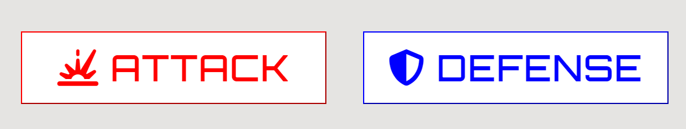

# Pokemon Matchups

Pokemon Matchups is a site that that is aimed at people who have an intermediate knowledge of pokemon type matchups. This website aims to provide a fun and helpful way for user to test their pokemon knowledge.

Pokemon Matchups is ultimately a website where users can put what they have already learned about Pokemon to the test.

# Design

In this section I will cover the overall design choices of this project.

## Design goals

The overall goal with the design of this project is to make it instantly recognisable what this application is about, create an interface that is simple and easy to use, while also making it visually appealing to the user.

## Tools

This project was done entirely in JavaScript, HTML5, and CSS3

## Layout

This project has aimed to have a clear layout. I have done this by using a logo and a large header that the user will instantly
be able to know what the the application is about. I have also included a brief introduction and instructions on how to get the game started

Inside the game area, the first thing you will see is two large buttons. Both of these buttons are clearly labeled so that the user can select which game they would like toplay. I have also stylised these with small images that represent the attack and defense nature of the games, as well as colour coded them in red and blue.

Underneath these buttons you will see the difficulty buttons, which all share one type of styling.

There is also the section for the user to input their name and a score area to keep track of right/wrong answers below the boxed off area with all the interactable sspactes of the UI.

In terms of font and styling, I decided to go with more jagged and blocking buttons and font elements as I felt that these were similar to that of old-school videogames.

All buttons also have a hover effect, and keep this effect when clicked to show the user what they have selected. Only one buttons of each type of button can be selected at a time, to the other clicked button will automaticall deselect.

When the user has entered either game, the opposing type will appear on the top of the game area. I had decided to put it here as they will not have to scroll to the bottom of the screen on smaller screen sizes. Under them, they will see the available types they can choose from, organised in rows of 4 on bigger screens, and decreasing on smaller screens.

## Colour Scheme

The colour scheme that I have used for this project is majority grey, red, blue, and black. I had decided on these colours to compliment the pokeball logo image I am using, as well as red and blue as pop colours to show the user that the areas using them are important and main feature of the application. I had also used some green and red on the scoring section, to represent positive and negative results.

# Features

In this section I will be covering the various features I have implemented. This application has 2 sepearte game mode, as well as 3 difficulty options, ultimately making a total combination of 6 game options. I have also implemented a feature that allows the user to enter their name before playing the game, which the game will use to give feedback to the user.

In the attack game, the user will see a type at the top of the game area. The user must then select what type of pokemon type is strong against this random one. If the user is correct an alert will pop down congratulating them. If they are incorrect, an alert will pop down telling them to try again. In both instances, the user is taken back to the interface to select a new game type, or select the same one if they so choose.

The defense game works very similar to this, as a type will appear at the top of the game area, but in this case they must choose a type that is weak against the random type. The alerts for this game are the same and they will be taken back to the selection screen after.

Depending on if their answers is correct or incorrect, the score will increment at the bottom of the screen. The score is visible at all time.

The difficulty will change some apsects of the game. In the easy difficulty, the user will only have 4 types to pick from, and also the random type they are against will only be one of those 4. In the medium difficulty this is increased to 6, and finally, in the hard difficulty this is increase again to 8.

# User Stories

- User Story 1: First impression of site functions.
- As a new user, I am a beginner to intermediate Pokemon player. I want to test my knowledge on this topic.

- User Story 2: Different buttons and their effects.
- As a user, I want to be able to clearly understand what each button on my screen does.

- User Story 3: Keeping track of progress.
- As a user, I want to be able to see how I am doing after each round, and see my grand total scores.

- User Story 4: Game flow.
- As a user, I want to understand what I have to do once I enter the game.

- User Story 5: What has been selected.
- As a user, I want to know what I have currently selected and which game I will be brought to before hitting play.

# Wireframes

Please see attached wireframes for the main page and game area. I have used desktop and mobile as my basis as large tablets appear like desktop and small tablets appear like mobile. The layout for attack and defense games are also identical, so they will both use the same wireframe.

# Logo, Header, and Intro

- The Logo and Header

- First thing a user see's. Designed to explain the functionality of the application and also make the subject matter very evident.
- This is shown both at the interface and while playing the game.

# Game Area

- Box containing all the buttons needed to access the game.

- This was designed to clearly and easily show what each button does.
- Each button is supposed to show the user what they can expect by clicking it.
- All of this buttons have been put inside of a need box, so that the user knows they muxt complete all fields before being able to play.

## Game Mode Buttons

- The first two buttons are the game mode buttons for the attack game and the defense game.
- They are both seperated by colour and can clearly be distinguished from one and other.
- They have been designed so that only one can be clicked at a time, and so that the system can read what game they would like to play correctly.

## Difficulty Buttons

- These buttons are designed so the user can select which difficulty to play.
- They all have the same styling, and like the game mode buttons, only one can be selected at a time.

## Username and Play Button

- This section is designed to that the user can enter their name, and then have that used for alerts at the end of the game.
- The play button will be clickable once all other buttons have been clicked. This will take you to whichever game is selected.

# Score Area

- This section is designed so the user can keep track of how they are doing in the game.

- This information will be displayed at all times.

# Attack Game (Easy - Hard)

- The Attack Game

- This is one of the teo game modes that the user is able to play from.
- This game has been designed to be intuitive for the user to use. The random element is displayed at the top of the page and the player must then guess which type would be effective.
- The user must select the type which they think is strong against the random type.
- The options for the user are displayed horizontally in rows of 4, which will decrease as the screen gets smaller.
- The difficulty option selected by the user before entering this game will determine how many types they can pick from, and also how many types can be randomly generated.
- In easy mode, there will be 4 types all displayed horizontally.
- In medium mode, there will be 6 types on two rows, 4 on the first and 2 on the second.
- In hard mode, there will be 8 types on two roes, each displaying 4.
- There is also a short paragraph asking you the question of which type to pick.

# Defense Game (Easy - Hard)

- The Defense Game

- This is the second game mode that the user is able to pick from.
- Visually very similar to the attack game, however the correct answer is different.
- This game has been designed to be intuitive for the user to use. The random element is displayed at the top of the page and the player must then guess which type would be effective.
- The user must select the type that they think is weak against the random type.
- The options for the user are displayed horizontally in rows of 4, which will decrease as the screen gets smaller.
- The difficulty option selected by the user before entering this game will determine how many types they can pick from, and also how many types can be randomly generated.
- In easy mode, there will be 4 types all displayed horizontally.
- In medium mode, there will be 6 types on two rows, 4 on the first and 2 on the second.
- In hard mode, there will be 8 types on two roes, each displaying 4.
- There is also a short paragraph asking you the question of which type to pick.

# Alerts

- Alerts that are given at the end of each game to let the user know if they are right or wrong.

- This alerts will appear after the user has selected there answer.
- The alert will give a short congratulatory message or a message telling them to try another game.
- Omce these alerts are seen, the user is taken back to the interface and the score will increment.

# Testing

- Ran html through W3C validator, have gotten back no errors but have gotten back 'warnings'. These warning are due to use of h1 elements in parts of the page that are not the very top. Due to time constraints, I am not able to change this right away as there is a lot of styling applied. If I were to re do the project, I would keep this in mind for future

- ran through Jigsaw css checker, no issues.

- I have checked screen compatibility for phone and tablet, I have checked tablet by using the inspect tool and shrinking down to size and have tested on my own personal mobile to assure it is responsive.

# Bugs

Throughout the project I had encountered several bugs which I will give details of in this section.

Resolved bugs:

- An issue I encountered was when developing my FAQ page. After designing it the footer was going up the page vertically and not horizontally at the bottom. I assumed it must be an issue with HTML and not CSS as it was unique to this page. After scanning through, I noticed I had left a tag unclosed, trying this brought most down to horizontal level, but not all. Then I noticed the entire thing was in one big section. When breaking it off into smaller one the issue had resolved.
- An issue I had encountered when making my page responsive was with my logo. I had it floated to the left and then pushed out with padding to the center. This looked good on desktop but not on other screen sizes. I had initially tried using a flex command to fix this but without much success. I ultimately decided to keep it floated to the left with a small amount of padding as this fixed the issue and made it look good on multiple screen sizes.
- Another bug I came across when when I was adding in my background images for the hero image. I was not able to get this to fit inside the the area I wanted to without looking distorted. After trying to alter the sizing, I used a larger image and a cover command which resolved the issue.
- I also encountered a bug when attaching the youtube videos to the tricks page. Initially were not loading correctling and I was unsure why. After having a look online, I realised I was using incorrect tags. When changed to iframe tags this then worked correctly.

Unresolved bugs:

- A bug I have left uncorrected is on the contact page. The styling shows shadowing on the desktop version but when I checked on the mobile this effect does not appear. I have tried to address this by increasing the shadow effect and this has not worked. Due to time constraints I was not able to find an alternative but I will update in future to something that is compatible with ios

- Another bug left uncorrected was the performance of the pages on mobile screens. I researched how to fix this and came across lazy loading. This solution looked like it would fix the issue how ever it would require JavaScript and I wanted to stick to html and css for this project.

# Lighthouse Testing

# Full Testing

The following devices were used during testing:

Desktop:

- Acer Aspire 5 17" screen

Tablet:

- iPad Air
- iPad Mini

Mobile Devices:

- iPhone 12
- iPhone 12 Pro
- Samsung Galaxy S8+

The following browsers were used during testing:

- Google Chrome
- Safari

All features that are on multiple pages (eg. Logo, Nav bar, Social media links) will only show up as tested in the first page they appear on, but have been tested on all pages.

## Home page testing

<table>
    <tr>
        <th>Feature</th>
        <th>Expected Outcome</th>
        <th>Test</th>
        <th>Result</th>
        <th>Pass/Fail</th>
    </tr>
    <tr>
        <td>Logo</td>
        <td>When clicking logo takes back to home page</td>
        <td>Click logo</td>
        <td>Takes back to home page</td>
        <td>pass</td>
    </tr>
    <tr>
        <td>Nav bar highlight</td>
        <td>Hovered page on nav bar will change colour</td>
        <td>Hover over nav bar</td>
        <td>Changed colour</td>
        <td>pass</td>
    </tr>
    <tr>
        <td>Hero image animation</td>
        <td>Hero image will have a zoom effect on all screen sizes</td>
        <td>Reloaded page on different screen sizes</td>
        <td>Animation occured</td>
        <td>pass</td>
    </tr>
    <tr>
        <td>Social media links</td>
        <td>All social media links on footer take you to new tab of the indicated social media</td>
        <td>Click each link</td>
        <td>Social media opened in seperate tabs</td>
        <td>pass</td>
    </tr>
</table>

## Tricks Page Testing

<table>
    <tr>
        <th>Feature</th>
        <th>Expected Outcome</th>
        <th>Test</th>
        <th>Result</th>
        <th>Pass/Fail</th>
    </tr>
    <tr>
        <td>Auto play</td>
        <td>Videos do not autoplay when page is loaded</td>
        <td>Reload page and check videos</td>
        <td>Does not autoplay</td>
        <td>pass</td>
    </tr>
    <tr>
        <td>Volume tab</td>
        <td>Videos will allow user to control volume once clicked</td>
        <td>Start video and mute volume with a click or control with cursor</td>
        <td>Volume mutes or goes up/down as intended</td>
        <td>pass</td>
    </tr>
    <tr>
        <td>Pause button</td>
        <td>Video will be able to be paused at anytime</td>
        <td>Click center of video and button in bottom left corner</td>
        <td>Video paused</td>
        <td>pass</td>
    </tr>
    <tr>
        <td>Full screen</td>
        <td>Videos will allow you to go full screen</td>
        <td>Click full screen icon in bottom right corner</td>
        <td>Video appeared full screen</td>
        <td>pass</td>
    </tr>
</table>

## FAQ Page

<table>
    <tr>
        <th>Feature</th>
        <th>Expected Outcome</th>
        <th>Test</th>
        <th>Result</th>
        <th>Pass/Fail</th>
    </tr>
    <tr>
        <td>Link to contact page</td>
        <td>When click on the our Contact Page link will take you to contact form in same tab</td>
        <td>Click on our Contact Page link</td>
        <td>Opens contact page in same link</td>
        <td>pass</td>
    </tr>
    <tr>
        <td>Links to recommended products</td>
        <td>When clicking on any of the recommended products linked will take you to a new tab with products</td>
        <td>Click on all 4 of the different links</td>
        <td>Opens all links in new page with the correct product displayed</td>
        <td>pass</td>
    </tr>
</table>

## Contact Page

<table>
    <tr>
        <th>Feature</th>
        <th>Expected Outcome</th>
        <th>Test</th>
        <th>Result</th>
        <th>Pass/Fail</th>
    </tr>
    <tr>
        <td>Form must be complete before submitting</td>
        <td>Form does not allow you to proceed unless every section complete</td>
        <td>Click submit with some area not complete</td>
        <td>Does not allow you to continue</td>
        <td>pass</td>
    </tr>
    <tr>
        <td>Email tab</td>
        <td>Email section will not proceed unless an email address is entered</td>
        <td>Click on submit with my full name in the email tab</td>
        <td>Email tab asks me to put in an email address before proceeding</td>
        <td>pass</td>
    </tr>
    <tr>
        <td>Radio button</td>
        <td>Only one radio button option can be selected at a time</td>
        <td>Click one radio button and then click each one after, tried this with every combonation of button</td>
        <td>Does not allow me to have more than one clicked</td>
        <td>pass</td>
    </tr>
    <tr>
        <td>Submit colour change</td>
        <td>Submit button changed colour when hovered over</td>
        <td>Hover over submit button</td>
        <td>Colour of button changes</td>
        <td>pass</td>
    </tr>
    <tr>
        <td>Submit button cursor</td>
        <td>Submit button changes cursor when hovered over</td>
        <td>Hover over submit button</td>
        <td>Cursor changes</td>
        <td>pass</td>
    </tr>
</table>

## Thank You Page

<table>
    <tr>
        <th>Feature</th>
        <th>Expected Outcome</th>
        <th>Test</th>
        <th>Result</th>
        <th>Pass/Fail</th>
    </tr>
    <tr>
        <td>Redirect to home page</td>
        <td>When left on page for 10 seconds, you will be redirected to home page</td>
        <td>Load page and wait 10 seconds</td>
        <td>Redirected to home page</td>
        <td>pass</td>
    </tr>
</table>

## 404 Error Page

<table>
    <tr>
        <th>Feature</th>
        <th>Expected Outcome</th>
        <th>Test</th>
        <th>Result</th>
        <th>Pass/Fail</th>
    </tr>
    <tr>
        <td>Redirect to home page</td>
        <td>When left on page for 5 seconds, you will be redirected to home page</td>
        <td>Load page and wait 5 seconds</td>
        <td>Redirected to home page</td>
        <td>pass</td>
    </tr>
</table>

# Deployment

- This was deployed in Github, I had done this by going to the seeting of the project, going down to pages in the sidebar, selecting the main branch, and deploying.
- the link to view this is here: <https://sean-obrien95.github.io/skate-friendly/>

# Forking and Cloning

## Forking the Repository

- Navigate to the main page of the "skate-friendly" repository on GitHub.
- Click on the Fork button in the upper-right corner of the page.
- This will create a copy of the repository under your GitHub account.

## Cloning the Repository

- On your forked repository page, click on the Code button.
- Select the HTTPS option to clone the repository using a secure connection.
- Copy the URL that is shown, which will be <https://github.com/sean-obrien95/skate-friendly.git>
- Open a terminal on your local machine.
- Navigate to the directory where you want to clone the repository.
- Run the following command: git clone <https://github.com/sean-obrien95/skate-friendly.git>
- This will create a local copy of the repository on your machine.

# Credit

- Picture credit 1 (hero image): Image by Katya Wolf: <https://www.pexels.com/photo/a-roller-skater-tying-the-lace-8733401/>
- Health benefits of roller skating taken from WebMD: <https://www.webmd.com/fitness-exercise/what-to-know-about-roller-skating#:~:text=Ways%20that%20roller%20skating%20can%20benefit%20your%20body>,Making%20you%20more%20flexible%207%20Increasing%20your%20agility
- Woods photo on home page: Photo by Fabian Wiktor: <https://www.pexels.com/photo/selective-focus-photo-of-grass-in-forest-3466355/>
- Dublin Convention Center Photo: Photo by Bhomick Attri: <https://www.pexels.com/photo/an-illuminated-building-during-night-time-11827803/>
- Coast line photo: Photo by Nati: <https://www.pexels.com/photo/scenic-view-of-sea-and-boats-16015100/>
- photo on tricks page: Photo by Laura Stanley: <https://www.pexels.com/photo/white-and-red-roller-skates-2005992/>
- photo on faq page: Photo by RDNE Stock project: <https://www.pexels.com/photo/woman-in-pink-tank-top-and-white-shorts-sitting-on-gray-concrete-road-7335426/>
- photo on contact page: Photo by RDNE Stock project: <https://www.pexels.com/photo/woman-sitting-on-green-grass-wearing-roller-skates-7335209/>
- Youtube videos from moxie roller skates <https://www.youtube.com/watch?v=s56SKfk9608>
  and queer girl straight skates <https://www.youtube.com/watch?v=tKkdItBQM9U> <https://www.youtube.com/watch?v=nUm9hZ7Xbf8>
- Favicon: fav icon: <a target="_blank" href="https://icons8.com/icon/BtCQacVxJCK1/skate">Skate</a> icon by <a target="_blank" href="https://icons8.com">Icons8</a>

### I had learned some commands from the following websites

- Flex commands: <https://stackoverflow.com/questions/38948102/center-one-and-right-left-align-other-flexbox-element>
- Using transition fade on submit button: <https://www.w3schools.com/csS/css3_buttons.asp>
- Applying shadow effect to contact form: <https://blog.logrocket.com/how-to-style-forms-with-css-a-beginners-guide/>

- Command for youtube videos: <https://www.w3schools.com/html/html_youtube.asp>

credit:

pokeball logo: taken from pinterest <https://www.pinterest.ie/pin/686447168226859156/> user Yiassu.com
